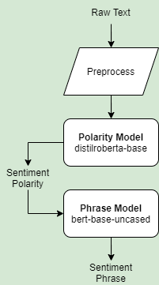
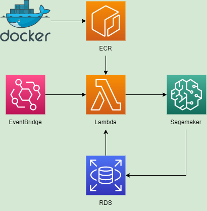

# Sentiment Analysis

## Model Architecture


## Setup

### 1. Ensure Docker is installed in system. 
- For Windows, ensure WSL 2 Backend is set up. Windows 11 is required. https://docs.docker.com/desktop/windows/wsl/

### 2. Ensure boto3 library is installed in environment.
```
pip install boto3
```

### 3. Set CLI variables in Jupyter notebook
- if using VSCode, ensure AWS Toolkit extension is installed
- Set up credentials and profile https://docs.aws.amazon.com/toolkit-for-vscode/latest/userguide/setup-credentials.html
```
account_id = boto3.client('sts').get_caller_identity().get('Account')
region = boto3.Session().region_name
ecr_repo = 'sentiment-inference'
processing_repo_uri = f'{account_id}.dkr.ecr.{region}.amazonaws.com/{ecr_repo}:latest'
```

### 4. Create docker folder
```
parent directory
│
└─ docker
    │   inference.py
    │   helper_functions.py
    │   Dockerfile
    └─  requirements.txt
```

### 5. Create Dockerfile
- Base docker image utilizing TensorRT image version 21.03 that has minimal requirements to run GPU-acceleration on AWS https://docs.nvidia.com/deeplearning/frameworks/support-matrix/index.html
- NVIDIA driver has to be downgraded within the docker image due to AWS requirements, this is due to TensorRT 21.03 coming with NVIDIA CUDA 11.2.1 that requires NVIDIA driver versions R450 (450.51) or earlier for Data Centre GPUs like NVIDIA T4
```
FROM nvcr.io/nvidia/tensorrt:21.03-py3

RUN apt-get update && apt install -y \
    nvidia-utils-450 \
    ubuntu-drivers-common

RUN apt update && \
    apt-get install -y \
    libpq-dev \
    gcc

COPY requirements.txt requirements.txt

RUN pip3 install -r requirements.txt

LABEL maintainer="Xaltius"

ENV PYTHONUNBUFFERED=TRUE

ENV TOKENIZERS_PARALLELISM=false

RUN mkdir -p /opt/ml/processing/model
RUN mkdir -p /opt/ml/processing/output

COPY . /usr/src/app
```

### 6. Create requirements.txt
```
pandas
transformers
tensorflow
psycopg2-binary
```

### 7. Write CLI commands
```
# Creates docker image from Dockerfile
!docker build --no-cache -t $processing_repo_uri docker

# Login into AWS via AWS CLI
!aws ecr get-login-password --region {region} | docker login --username AWS --password-stdin {account_id}.dkr.ecr.{region}.amazonaws.com

# Creates ECR repository if it does not exist
!aws ecr create-repository --repository-name $ecr_repo

# Pushes the created docker image to ECR repository
!docker push $processing_repo_uri

# Deletes created docker image from system memory
!docker image rm $processing_repo_uri
```

### 8. Write execution script in Lambda
- Use boto3 functions to deploy Sagemaker Processing Jobs
- Utilize `g4dn.xlarge` instance type made up of T4 GPUs for most optimal performance and pricing https://aws.amazon.com/ec2/instance-types/
- Insert important variables like keys and passwords into test inputs and call as dictionary for safety
- ProcessingJobs accepts multiple inputs and outputs, just add into the ProcessingInput function
- An Output has to be specified, can simply output an empty json/csv into an S3 Bucket if no output is required
```
import boto3
import time

def ProcessingInput(input_name, source, destination):
    return {
        'InputName': input_name,
        'S3Input': {
            'S3Uri': source,
            'LocalPath': destination,
            'S3DataType': 'S3Prefix',
            'S3InputMode': 'File'}
    }
    
def ProcessingOutput(output_name, source, destination):
    return {
        'Outputs': [{
            'OutputName': output_name,
            'S3Output': {
                'S3Uri': destination,
                'LocalPath': source,
                'S3UploadMode': 'EndOfJob'}}]
    }
    
def lambda_handler(event, context):
    
    timestamp = time.strftime('%Y%m%d-%H%M%Shrs')
    
    models = ProcessingInput(
        input_name='models',
        source=f"s3://{event['bucket_name']}/models/sentiment_models.tar.gz",
        destination='/opt/ml/processing/model/')
        
    output = ProcessingOutput(
        output_name='output',
        source='/opt/ml/processing/output',
        destination='s3://syalabi-bucket/outputs')
        
    processing_resource = {
        'ClusterConfig': {
            'InstanceCount': 1,
            'InstanceType': 'ml.g4dn.xlarge',
            'VolumeSizeInGB': 30}
    }
    
    app_specification = {
        'ImageUri': '183640780274.dkr.ecr.ap-southeast-1.amazonaws.com/sentiment-inference',
        'ContainerEntrypoint': [
            "python3", 
            "/usr/src/app/inference.py"],
        'ContainerArguments': [
            f"--access_id={event['access_id']}", 
            f"--access_key={event['access_key']}",
            f"--bucket_name={event['bucket_name']}",
            f"--host={event['host']}",
            f"--port={event['port']}",
            f"--user={event['user']}",
            f"--password={event['password']}",
            f"--dbname={event['dbname']}"]
    }
    
    sagemaker_client = boto3.client('sagemaker')
    processing_response = sagemaker_client.create_processing_job(
        ProcessingInputs=[models],
        ProcessingOutputConfig=output,
        ProcessingJobName=f'sentiment-inference-{timestamp}',
        ProcessingResources=processing_resource,
        StoppingCondition={'MaxRuntimeInSeconds': 600},
        AppSpecification=app_specification,
        RoleArn=event['role_arn'])
    
    return processing_response
```